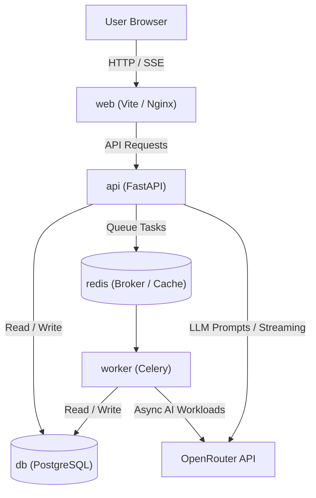

# Repository Architecture & Structural Blueprint

This document outlines the architectural boundaries, repository layout, technology stack, and service topology for `idoitmyself`.

## 1. Technology Stack

| Layer | Technology | Purpose |
| :--- | :--- | :--- |
| **Orchestration** | Docker & Docker Compose | Multi-container local environment & deployment orchestration |
| **API Backend** | Python 3.12+, FastAPI, Uvicorn | Async REST API, OpenAPI generation, AI streaming |
| **Database** | PostgreSQL | Relational persistence |
| **Cache & Queue** | Redis | Message broker & result backend for async tasks |
| **Task Worker** | Celery | Background job execution and long-running tasks |
| **AI Integration** | OpenRouter | Unified LLM routing, chat completions, streaming |
| **Frontend UI** | Vite + React + TypeScript | Fast client-side Single Page Application (SPA) |
| **Styling & Components** | Tailwind CSS + shadcn/ui | Accessible, aesthetic, high-velocity component library |

---

## 2. Service Topology (Docker Compose)



---

## 3. Directory Structure

```text
.
├── .ai/                            # AI Agent knowledge base & context
│   ├── architecture.md             # System design & structural blueprint (this file)
│   ├── conventions.md              # Coding standards, style, and rules
│   └── decisions/                  # Architectural Decision Records (ADRs)
│       └── 0001-core-tech-stack...md
├── docs/                           # Human-facing technical & user documentation
│   ├── architecture/               # Deep-dive technical specs & component designs
│   └── guides/                     # Developer guides, tutorials, onboarding
├── scripts/                        # Development, build, and automation utilities
├── src/                            # Application source code
│   ├── backend/                    # FastAPI application, domain logic, workers
│   │   ├── app/                    # API routes, core services, database models
│   │   └── workers/                # Celery task definitions
│   └── frontend/                   # Vite + React (TypeScript) + shadcn/ui SPA
│       ├── src/
│       │   ├── components/         # UI components (shadcn/ui in components/ui)
│       │   ├── pages/              # Application views / routes
│       │   ├── lib/                # API client, utilities, hooks
│       │   └── types/              # TypeScript interfaces and OpenAPI types
├── tests/                          # Automated test suites
│   ├── backend/                    # Pytest unit & integration tests
│   └── frontend/                   # Vitest / React Testing Library tests
├── docker-compose.yml              # Local container orchestration
├── AGENTS.md                       # Agent operational guidelines & repository map
├── LICENSE                         # Repository license (MIT)
└── README.md                       # Project overview & quickstart
```

---

## 4. Component Responsibilities

### Backend (`src/backend`)
* **API Endpoints (`app/api/`)**: Thin routers validating input with Pydantic and delegating to services.
* **Domain & Services (`app/services/`)**: Business logic and orchestrators for LLM prompts, storage operations, and task dispatches.
* **AI Client (`app/services/ai.py`)**: OpenRouter client wrapper handling prompt templates, retries, and streaming response generators.
* **Database Models (`app/models/`)**: SQLAlchemy/SQLModel schemas and migrations (Alembic).
* **Async Workers (`src/backend/workers/`)**: Celery tasks for heavy computation or background jobs.

### Frontend (`src/frontend`)
* **Component Layer (`src/components/ui/`)**: Pure, reusable shadcn/ui primitives.
* **Feature Views (`src/pages/`)**: Composite page layouts consuming domain services.
* **API Integration (`src/lib/api.ts`)**: Typed HTTP client communicating with FastAPI endpoints.

---

## 5. Architectural Principles

1. **Decoupled Architecture**: Frontend and backend are completely decoupled. Communication happens strictly over typed HTTP APIs, SSE (Server-Sent Events), or WebSockets.
2. **Container-First**: Every service must be reproducible via Docker Compose without relying on ambient local machine dependencies.
3. **Strict Separation of Concerns**: Fast, synchronous requests stay on FastAPI; compute-intensive or long-running workflows offload to Celery.
4. **Decision Traceability**: Any major architectural shift or dependency addition must be logged in `.ai/decisions/`.
